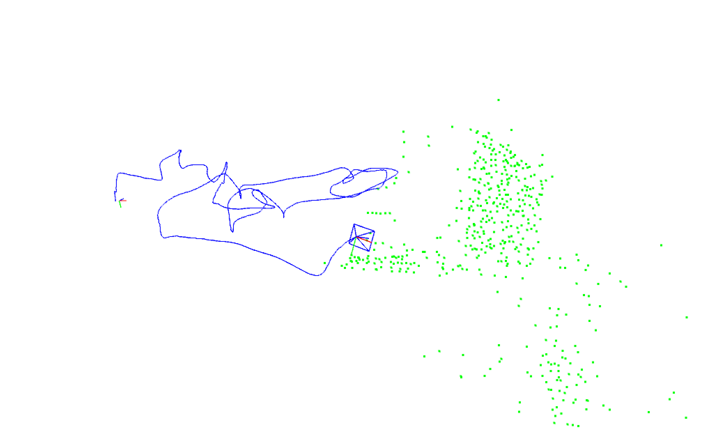

# rd_vio

This repo is the plain CMake version for rd-vio, separated and modified from [xrslam](https://github.com/openxrlab/xrslam). Check the original repo for detail.

*RD-VIO: Robust Visual-Inertial Odometry for Mobile Augmented Reality in Dynamic Environments*

And now it is:
- mono visual-inertial odometry
- single-thread only

What is removed:
- global localizer
- global interface

What is add:
- a simple viewer using [Pangolin](https://github.com/stevenlovegrove/Pangolin)
- a simple dataset reader (currently euroc only)

#### notes
The main system APIs can be founded in 'src/rdvio/rdvio.hpp'

EuRoC example can be founded in 'examples'

#### install
Make sure you have installed:
- OpenCV 4.x
- Eigen 3.4.0
- Ceres-Solver
- yaml-cpp
- pangolin

Then run the following commands:
```sh
# clone the repo
cd rd_vio

mkdir build
cd build

cmake ..
make -j4
```

#### test on EuRoC
```sh
cd build
./examples/euroc ../configs/euroc_sensor.yaml ../configs/euroc_slam.yaml $/path/to/euroc/mav0
```

#### preview
  
*\*test on euroc v101 easy*
